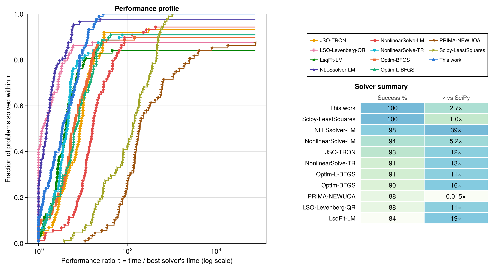
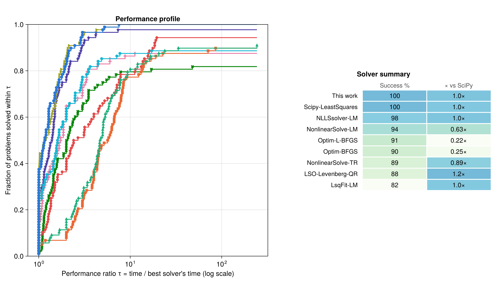

# nonlinearlstr.jl: An Experiment to Benchmark Nonlinear Least-Squares Solvers and Propose a Trust Region Alternative

[](https://github.com/vcantarella/nonlinearlstr.jl/actions/workflows/CI.yml?query=branch%3Amain)

This repository is two things:

1. **A reproducible benchmark suite** for Nonlinear Least-Squares (NLLS) solvers across the Julia and Python ecosystems, run on standard problem sets with per-solver fairness taken seriously.
2. **A proposed trust-region Levenberg–Marquardt solver**, developed here and labeled *"This work"* in the benchmarks. Its design goal is robustness — solve every problem — while spending as few Jacobian evaluations as possible.

The headline finding: judged by raw wall-clock on small test problems, the proposed solver looks unremarkable — other codes finish individual problems faster. But it is one of only two solvers (with SciPy) that solves **100% of the problems**, and it does so in **few iterations**. When function/Jacobian evaluations are expensive — the situation in nearly every real-world fit, where the model is an ODE/PDE solve or a simulation — evaluation count dominates wall-clock, and the proposed solver moves to the front of the field.

## The benchmark suite

### What is compared

| Solver (label in figures) | Package | Method |
|---|---|---|
| This work | `nonlinearlstr.jl` v0.2 | LM trust region (QR) |
| NonlinearSolve-TR / -LM | NonlinearSolve.jl v4.20 | TrustRegion, LevenbergMarquardt |
| JSO-TRON | JSOSolvers.jl v0.14 | TRON |
| LSO-Levenberg-QR | LeastSquaresOptim.jl v0.8 | Levenberg–Marquardt (QR) |
| LsqFit-LM | LsqFit.jl v0.16 | Levenberg–Marquardt |
| NLLSsolver-LM | NLLSsolver.jl v4.0 | Levenberg–Marquardt |
| Optim-BFGS / -L-BFGS | Optim.jl v2.2 | quasi-Newton on 0.5‖r‖² |
| PRIMA-NEWUOA | PRIMA.jl v0.2 | NEWUOA (derivative-free, shown for reference) |
| Scipy-LeastSquares | SciPy 1.18 (Python 3.13, via PythonCall) | `least_squares` (TRF) — the **baseline** |

Test problems come from **NLSProblems.jl** (via NLPModels.jl); CUTEst problems are supported by the same harness. Julia 1.12.

### Fairness

- Every solver receives the **same analytic residual and Jacobian**, wrapped as in-place closures with buffers preallocated once, so no solver pays extra allocation or wrapper cost per evaluation.
- Timing is the **minimum over repeated solves** (Chairmarks.jl), with problem construction excluded from the timed region.
- A run counts as a **success** only if it reaches the best cost found by *any* solver on that problem (within 1e-4, absolute or relative) — converging to a worse local minimum does not count. The success metric is therefore **cost-based** and independent of each package's self-reported convergence flag.

### Termination criteria: one value, each solver's own criteria

Solver packages implement different stopping *criteria*, so they cannot be forced onto
one identical rule. Instead, **every tolerance a solver exposes is set to 1e-8**, and
each solver terminates through whatever criteria it natively implements at that value:

| Criterion class | Who tests it (all at 1e-8) |
|---|---|
| First-order (gradient) | This work (`‖J'r‖₂`), SciPy `gtol` (∞-norm, scaled), Optim `g_tol` (∞-norm), LsqFit `g_tol`, TRON `atol` (projected gradient, `rtol=0`), LSO `g_tol` (∞-norm) |
| Step size | **Disabled** where it is a single-step give-up test (SciPy `xtol = None`, LSO/LsqFit `x_tol = 0`): one small step is the weakest evidence of optimality — it fires during slow crawls — and "this work" has no such test, so removing it keeps the criterion sets symmetric. Kept where structural: NonlinearSolve's stall detector (32 *consecutive* steps ≤ `abstol` — its only exit at nonzero residual) and PRIMA's `rhoend` (a DFO method's resolution parameter) |
| Cost stagnation | This work `ftol`, SciPy `ftol`, LSO `f_tol`, NLLSsolver `reldcost` |
| Residual norm | NonlinearSolve `abstol` (on `‖r‖₂`) |
| Trust-region resolution | PRIMA `rhoend` (the x-resolution of a derivative-free method) |

A caveat stated openly: tolerances on different quantities are *not* equally strict even
at the same number — near a minimum, cost error scales as the square of parameter error,
and gradient scales carry the Jacobian's magnitude. A single value does not remove that
incommensurability; it removes the *choice* of per-class pairing as a degree of freedom.
What makes the comparison robust is the success metric: a run counts as a success based
on its achieved cost (within 1e-4 of the best found), which is orders of magnitude
looser than any 1e-8 criterion, so reported success rates are insensitive to the exact
tolerance value — the tolerances only decide when a solver stops polishing.

Iteration budget: **`max_iter = 400`** for every iterative solver (passed explicitly,
including to LSO whose own default is 1000). Hidden wall-clock caps are removed
(TRON and NLLSsolver default to a 30 s `max_time`; the suite lifts both).

### Known limitations (read before citing numbers)

- **NonlinearSolve has no gradient-based stopping for NLLS.** Its API terminates on the
  residual norm (`abstol`) plus a stalled-step detector (32 consecutive steps below
  `abstol` → `StalledSuccess`, its documented "found a local minimum" exit). On the
  **30/88 problems with nonzero residual at the solution**, no residual tolerance can
  fire, so its exit there is the stall path — the same criterion *class* as this work's
  trust-radius-collapse exit (`radius < 1e-8`), but it pays a ~32-iteration confirmation
  tail that our immediate exit does not. This mismatch is inherent to its API; treat
  small timing gaps against NonlinearSolve accordingly.
- **NLLSsolver stops on cost decrease only** (`reldcost = 1e-8`); it exposes no gradient
  criterion. Different class from everyone else, kept because it is what the package offers.
- **PRIMA-NEWUOA is derivative-free** and budgeted as `maxfun = 400 × n_vars`
  (one "iteration" ≈ one model rebuild). It stops at trust-region radius
  `rhoend = 1e-8`. Shown for reference, not as a like-for-like competitor.
- **SciPy is called from Julia via PythonCall**: every residual/Jacobian evaluation
  crosses the Julia↔Python boundary, and SciPy's timings include that overhead. Its
  budget is `max_nfev = 1000` *evaluations* (not 400 iterations — TRF uses ~1–3
  evaluations per iteration, so the budgets are comparable but not identical units).
- **Norm conventions differ**: this work tests `‖g‖₂ ≤ 1e-8` while SciPy/Optim/LSO test
  ∞-norm variants. Since `‖g‖∞ ≤ ‖g‖₂`, competitors stop at or before our criterion —
  the mismatch, where it matters, favors the competitors' timings.
- **Iteration counts are not comparable across solvers** (LM iterations vs. SciPy
  Jacobian evaluations vs. PRIMA function evaluations; LsqFit does not expose a count and
  is recorded as 0). They appear in the CSVs for context and are never plotted.
- **The delay benchmark (Figure 2) delays only Jacobian and gradient evaluations**
  (200 ms); residual and objective evaluations stay cheap. This *flatters* line-search
  methods (BFGS/L-BFGS), whose objective-only line-search evaluations would also be
  expensive in a real simulator — their Figure 2 results are favorable upper bounds.
- **Remaining wrapper asymmetries**: TRON consumes the NLPModels model directly rather
  than the extracted closures (thin call-path difference); NLLSsolver's static-size
  residual API requires a per-evaluation `collect`/`SVector` wrapper (overhead the others
  don't pay — it is nonetheless the fastest solver on small problems); Optim's
  quasi-Newton baselines run the scalar `0.5‖r‖²` formulation with out-of-place closures.

### Metrics

Figures report **Dolan–Moré performance profiles** (Dolan & Moré, 2002): for each solver and problem, the performance ratio τ = time / best solver's time on that problem; the curve shows the fraction of all problems solved within τ. The height at τ = 1 reads as "how often is this solver the fastest", the right-hand asymptote as robustness. The summary table gives the success rate and the cumulative-time speed-up relative to the SciPy baseline.

### Running it

```bash
# 1. Run the benchmarks (writes raw results to benchmark/results/*.csv)
julia --project=benchmark benchmark/scripts/compare_unconstrained.jl
julia --project=benchmark benchmark/scripts/compare_with_delay.jl

# 2. Build the figures from the saved results (seconds; no solver runs)
julia --project=benchmark benchmark/scripts/plot_results.jl
```

Both benchmark scripts accept `MAX_VARS` and `PROBLEM_LIMIT` environment variables for quick capped runs (e.g. `PROBLEM_LIMIT=5 julia --project=benchmark ...`). Plotting is deliberately decoupled from benchmarking: figure styling can be iterated without re-running solvers. Additional scripts cover bound-constrained problems (`compare_bounded.jl`) and internal subproblem-strategy comparisons (`internal_variants.jl`).

## Results

### Standard benchmark: cheap evaluations


*Figure 1: Performance profile and summary on the full unconstrained NLSProblems set (88 problems). "This work" and SciPy are the only solvers with a 100% success rate; "This work" is 2.7× faster than SciPy overall. Solvers with steeper early curves (NLLSsolver, LeastSquaresOptim) are faster per problem but plateau below 100%.*

On these small, microsecond-scale problems, per-iteration overhead dominates and the lightest wrappers win the left side of the profile. The proposed solver's per-iteration cost (careful factorizations, exact subproblem solves) buys something different: it converges on **every** problem, in a median of ~13 iterations.

### Real-world benchmark: expensive evaluations

To simulate a realistic model — where each Jacobian evaluation means re-solving an ODE/PDE or running a simulation — the second benchmark injects a 200 ms delay into every Jacobian *and* gradient evaluation (the gradient J′r requires the Jacobian, so gradient-based solvers must pay it too).


*Figure 2: Same experiment with 200 ms per Jacobian/gradient evaluation (same 88 problems; colors and markers as in Figure 1). Evaluation count now dominates wall-clock and the few-iteration LM methods cluster at the front: "This work" leads the profile and ties the SciPy baseline (1.0×) as the only pair at 100% success, with NLLSsolver effectively tied on speed (1.0×) at 98%. NonlinearSolve-LM pays its stall-confirmation tail (0.63×), and line-search quasi-Newton methods (BFGS/L-BFGS) drop to 0.22–0.25× because their line searches evaluate the gradient several times per iteration. LSO's 1.2× is computed over its own smaller successful set (88% of problems).*

This is the regime the solver is designed for: **fewer steps beat cheaper steps** as soon as the model is expensive.

### Bound-constrained problems (IN PROGRESS)


*Figure 3: Performance profile on bound-constrained NLLS problems (Trust Region Reflective implementation).*

## The proposed solver

- **Unconstrained NLLS**: Levenberg–Marquardt style trust region algorithm.
- **Bounded NLLS**: Trust Region Reflective algorithm using Coleman–Li scaling.
- **Robust subproblem solvers**: recursive QR (fast, default), column-pivoted QR (stable), SVD (maximum robustness for ill-conditioned Jacobians).
- **Allocation-free hot paths** with aggressive buffer reuse.

### Usage

```julia
using nonlinearlstr, LinearAlgebra

# 1. Define residual function (f: R^n -> R^m)
function rosenbrock_res(x)
    return [10.0 * (x[2] - x[1]^2), 1.0 - x[1]]
end

# 2. Define Jacobian function (J: R^n -> R^{m x n})
function rosenbrock_jac(x)
    return [-20.0 * x[1] 10.0; -1.0 0.0]
end

# 3. Solve
x0 = [-1.2, 1.0]
x_opt, f_opt, g_opt, iter = nonlinearlstr.lm_trust_region(
    rosenbrock_res,
    rosenbrock_jac,
    x0,
    nonlinearlstr.QRrecursiveSolve() # subproblem strategy (optional)
)

println("Solution: ", x_opt)
```

For box constraints (`lb <= x <= ub`), use `lm_trust_region_reflective`:

```julia
lb = [-2.0, -2.0]
ub = [0.5, 0.5] # forces the solution away from the global minimum (1,1)

x_opt_bounded, _, _, _ = nonlinearlstr.lm_trust_region_reflective(
    rosenbrock_res,
    rosenbrock_jac,
    x0;
    lb = lb,
    ub = ub
)

println("Bounded Solution: ", x_opt_bounded)
```

### Methodology

**Trust region framework.** At each iteration the algorithm minimizes a model of the objective `F(x) = 0.5 * ||f(x)||^2` around the current point:
```math
min_p  || J_k p + f_k ||^2  \quad \text{subject to} \quad || D_k p || \le \Delta_k
```
where `J_k` is the Jacobian, `f_k` the residuals, `D_k` a scaling matrix, and `Δ_k` the trust region radius.

**Subproblem solution.** The constrained subproblem is equivalent to the regularized system
```math
(J_k^T J_k + \lambda D_k^T D_k) p = -J_k^T f_k
```
for a Lagrange multiplier `λ ≥ 0`, found by Newton's method. The factorization (QR or SVD) of `J` is computed once per iteration and reused across candidate `λ` values — this is why the solver can afford exact subproblem solves while keeping Jacobian evaluations to a minimum.

**Bounds (Coleman–Li).** The Trust Region Reflective method uses the Coleman–Li scaling matrix, which incorporates distance to the bounds so descent directions steer away from bounds as they are approached — iterates stay strictly feasible without active-set management.

## Installation

```julia
using Pkg
Pkg.add(url="https://github.com/vcantarella/nonlinearlstr.jl")
```

## Status

In development. The benchmark suite is intended as a reproducible reference for comparing NLLS implementations; the solver as a robust reference implementation of trust-region methods in Julia.
