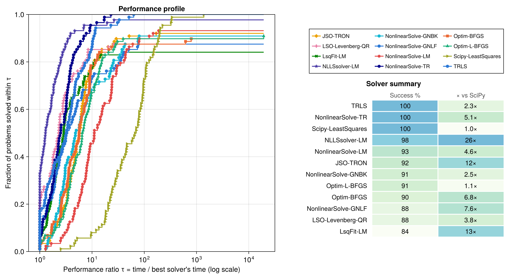
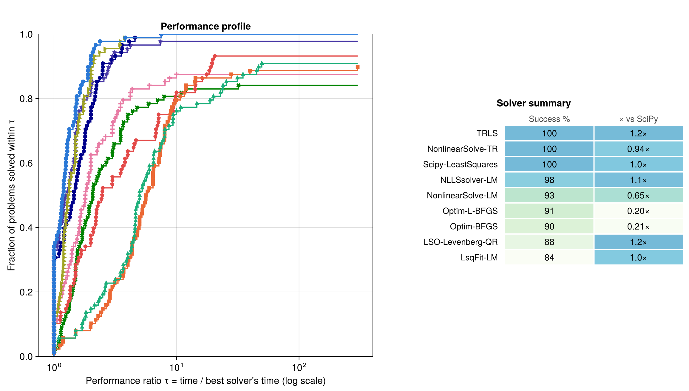
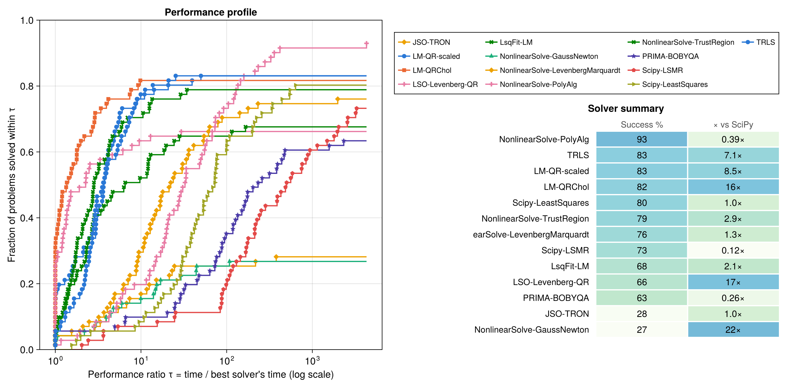

# [Benchmarks](@id benchmarks)

Besides the methods, I have produced a complete benchmark suite comparing this implementation with other popular implementations in the Julia ecosystem. I have taken the SciPy solver as the baseline. SciPy uses the same exact trust-region strategy, albeit factorizing the Jacobian matrix $J$ by SVD, instead of the multiple factorization approaches in this repo.

Most implementations in the Julia ecosystem either implement the Levenberg–Marquardt method, which updates $\lambda$ heuristically, or solve the trust-region subproblem with a safeguarded Moré-style iteration (`NonlinearSolve.TrustRegion`) or approximately by the dogleg approach (`NonlinearSolve.TrustRegionDogleg`). We also include Gauss–Newton methods with line search.

## Solvers compared and test problems

| Solver (label in figures) | Package | Method |
|---|---|---|
| TRLS | `TrustRegionLeastSquares.jl` v0.1 | LM trust region, `QRStrategy` |
| NonlinearSolve-TR / -LM | NonlinearSolve.jl v4.32 | TrustRegion, LevenbergMarquardt |
| NonlinearSolve-GNBK / -GNLF | NonlinearSolve.jl v4.32 | GaussNewton with backtracking and with Li–Fukushima line search |
| JSO-TRON | JSOSolvers.jl v0.14 | TRON |
| LSO-Levenberg-QR | LeastSquaresOptim.jl v0.8 | Levenberg–Marquardt (QR) |
| LsqFit-LM | LsqFit.jl v0.16 | Levenberg–Marquardt |
| NLLSsolver-LM | NLLSsolver.jl v4.1 | Levenberg–Marquardt |
| Optim-BFGS / -L-BFGS | Optim.jl v2.3 | quasi-Newton on 0.5‖r‖² |
| PRIMA-NEWUOA / -BOBYQA | PRIMA.jl v0.2 | NEWUOA and BOBYQA (derivative-free; BOBYQA in the bounded run, both in the hard-problem run) |
| Scipy-LeastSquares | SciPy 1.15.3 (Python 3.10, via PythonCall) | `least_squares` (TRF) — the **baseline** |

Test problems come from **NLSProblems.jl** v0.5 (via NLPModels.jl); some CUTEst problems are used for the bound-constrained sets. Measured on Julia 1.12, Linux x86-64; exact package versions are recorded in `benchmark/AUDIT.md` (the committed `benchmark/Manifest.toml` cannot yet resolve the latest NonlinearSolve alongside NLPModels — see the caveat there).

The `TRLS` row runs the `QRStrategy` variant, which is what the figures show. The package default is
`QRCholStrategy`, which is faster per iteration but squares the condition number; `internal_variants.jl` compares all four strategies against each other.

## Remarks on timings and decisions made in this approach

- Every solver receives the **same analytic residual and Jacobian**, wrapped as in-place closures with buffers preallocated once, so no solver pays extra allocation or wrapper cost per evaluation. The exception is the TRON solver, which uses the structure from NLSProblems directly.
- Timing is the **minimum over repeated solves** (Chairmarks.jl), with problem construction excluded from the timed region.
- A run counts as a **success** only if it reaches the best cost found by *any* solver on that problem (within 1e-4). The success metric is therefore **cost-based** and independent of each package's self-reported convergence flag. Runs that violate their bounds cannot set the reference best, and neither can a *negative* cost reported by a run the solver itself flags as non-converged — the expanded least-squares objective can evaluate below the true minimum at a diverged iterate.
- There are caveats and limitations to this approach. Please do not take these numbers too strictly.

## Metrics

Figures report **Dolan–Moré performance profiles** [DM02](@cite): for each solver and problem, the performance ratio τ = time / best solver's time on that problem; the curve shows the fraction of all problems solved within τ. The height at τ = 1 reads as "how often is this solver the fastest", the right-hand asymptote as robustness. The summary table gives the success rate and the cumulative-time speed-up relative to the SciPy baseline.

## Running it

```bash
# 1. Run the benchmarks (writes raw results to benchmark/results/*.csv)
julia --project=benchmark benchmark/scripts/compare_unconstrained.jl
julia --project=benchmark benchmark/scripts/compare_with_delay.jl

# 2. Build the figures from the saved results (seconds; no solver runs)
julia --project=benchmark benchmark/scripts/plot_results.jl
```

Both benchmark scripts accept `MAX_VARS` and `PROBLEM_LIMIT` environment variables for quick capped runs (e.g. `PROBLEM_LIMIT=5 julia --project=benchmark ...`). Plotting is deliberately decoupled from benchmarking: figure styling can be iterated without re-running solvers. Additional scripts cover bound-constrained problems (`compare_bounded.jl`) and internal subproblem-strategy comparisons (`internal_variants.jl`).

## Results

### Standard benchmark: cheap evaluations


*Figure 1: Performance profile and summary on the full unconstrained NLSProblems set (88 problems). TRLS, NonlinearSolve-TR and SciPy all reach a 100% success rate, with cumulative solve times of 0.574 s, 0.258 s and 1.318 s respectively. Solvers with steeper early curves (NLLSsolver, LeastSquaresOptim) are faster per problem but plateau below 100%.*

| Solver | Success % | Median iterations | Cumulative time |
|---|---|---|---|
| **TRLS** | **100.0** | 12.5 | 0.574 s |
| NonlinearSolve-TR | **100.0** | 34.0 | 0.258 s |
| Scipy-LeastSquares | **100.0** | 13.0 | 1.318 s |
| NLLSsolver-LM | 97.7 | 13.5 | 0.050 s |
| NonlinearSolve-LM | 93.2 | 37.5 | 0.287 s |
| JSO-TRON | 92.0 | 16.0 | 0.110 s |
| NonlinearSolve-GNBK | 90.9 | 16.0 | 0.528 s |
| Optim-L-BFGS | 90.9 | 33.0 | 1.147 s |
| Optim-BFGS | 89.8 | 33.0 | 0.194 s |
| NonlinearSolve-GNLF | 87.5 | 15.0 | 0.173 s |
| LSO-Levenberg-QR | 87.5 | 13.0 | 0.346 s |
| LsqFit-LM | 84.1 | not exposed | 0.100 s |

On these small, microsecond-scale problems, per-iteration overhead dominates and the lightest wrappers win the left side of the profile:
- NLLSsolver solves its 97.7% faster than anyone else. The package also enforces the use of StaticArrays, so perhaps not a fair comparison.
- Most Julia packages have very fast solvers, about an order of magnitude faster than SciPy's baseline method.
- TRLS, NonlinearSolve-TR and SciPy all solve 100% of the problems to the minimum cost reported. Of the three, TRLS uses the fewest iterations (median 12.5 against 34 and 13) — which is what matters when evaluations are expensive (Figure 2) — while NonlinearSolve-TR has the lowest cumulative solve time.

### Real-world benchmark: expensive evaluations

To simulate a realistic model — where each Jacobian evaluation means re-solving an ODE/PDE or running a simulation — the second benchmark injects a 200 ms delay into every Jacobian *and* gradient evaluation (the gradient `Jᵀf` requires the Jacobian, so gradient-based solvers pay it too).


*Figure 2: Same 88 problems with 200 ms per Jacobian and gradient evaluation; colors and markers as in Figure 1. Evaluation count now dominates wall-clock, and the few-iteration LM methods cluster at the front.*

| Solver | Success % | Median iterations | Median time | Cumulative time | vs SciPy |
|---|---|---|---|---|---|
| **TRLS** | **100.0** | 12.5 | 2.32 s | 421.3 s | **1.16×** |
| Scipy-LeastSquares | **100.0** | 13.0 | 2.62 s | 488.7 s | 1.00× |
| NonlinearSolve-TR | **100.0** | 34.0 | 3.22 s | 520.0 s | 0.94× |
| NLLSsolver-LM | 97.7 | 13.5 | 2.72 s | 442.5 s | 1.10× |
| NonlinearSolve-LM | 93.2 | 37.5 | 4.95 s | 747.2 s | 0.65× |
| Optim-L-BFGS | 90.9 | 33.0 | 8.36 s | 2439.2 s | 0.20× |
| Optim-BFGS | 89.8 | 33.0 | 9.06 s | 2352.5 s | 0.21× |
| LSO-Levenberg-QR | 87.5 | 13.0 | 2.62 s | 416.0 s | 1.17× † |
| LsqFit-LM | 84.1 | not exposed | 2.92 s | 498.3 s | 0.98× † |

† computed over that solver's own smaller successful set, so not comparable with the 100% rows.

This is the regime the solver is designed for: **fewer steps beat cheaper steps** once the model is
expensive. The ordering inverts relative to Figure 1 — the lightest wrappers no longer win, because
wrapper overhead is now invisible next to a 200 ms evaluation, and what is left is how many
evaluations each method needs. TRLS has both the lowest median time and the lowest cumulative time of
any solver at 100% success.

The Optim methods L-BFGS and BFGS (line-search quasi-Newton methods) pay the most, at roughly a fifth of the baseline's throughput. Their line searches evaluate the gradient several times per iteration, and every one of those costs
200 ms. That is the honest shape of the trade, and it is why those two rows carry a 15-minute
wall-clock cap here (see Benchmark limitations).

### Underdetermined problems

Every problem in the unconstrained set, with residual rows cropped so there are fewer equations than
unknowns (`crop_nls_functions`). Each cropped problem has a zero-residual solution, generically a
whole manifold of them, so the interesting question is not only whether a solver lands on the
manifold but how far it travels to get there: a minimum-norm method stays near `x0`.

| Solver | Success % | Median iterations | Cumulative time | Median ‖x*-x0‖ |
|---|---|---|---|---|
| LM-QR-scaled | **100.0** | 4.0 | 0.038 s | 2.200 |
| **TRLS** | **100.0** | 4.0 | 0.096 s | 2.193 |
| NonlinearSolve-TR | **100.0** | 5.0 | 0.117 s | 2.200 |
| Scipy-LeastSquares | **100.0** | 16.0 | 1.627 s | 2.200 |
| NonlinearSolve-GNBK | 98.9 | 5.0 | 0.065 s | 2.200 |
| Optim-BFGS | 97.7 | 12.0 | 0.143 s | 2.200 |
| Optim-L-BFGS | 97.7 | 15.5 | 0.980 s | 2.200 |
| NonlinearSolve-LM | 97.7 | 9.0 | 0.035 s | 2.126 |
| NonlinearSolve-GNLF | 96.6 | 5.0 | 0.031 s | 2.200 |
| NLLSsolver-LM | 96.6 | 6.0 | 0.027 s | 2.190 |
| LSO-Levenberg-QR | 86.4 | 6.5 | 0.066 s | 2.200 |
| LsqFit-LM | 84.1 | not exposed | 0.042 s | 2.207 |

The strategy that is actually designed for this case is the LQ family, which returns the
minimum-norm step through a complete orthogonal decomposition. `internal_variants.jl` scores it
separately: `LM-LQ` reaches 100% with the highest min-norm rate (0.97 of problems within 1e-3 of the
smallest `‖x*-x0‖` any variant found), and `JacobianScaling` measurably hurts there, dropping the
rate to 0.80 — scaling pulls the step away from the minimum-norm direction.

### Hard exponential fits, where this solver does not win

Six deliberately nasty exponential-fitting problems from Lukšan [Luk96](@cite), run both in
their original parameterization and with `x = exp(y)`. Parameters span orders of magnitude: A.3
starts at `[0.02, 4000, 250]` and A.5 at `[1e5, 1e5, 1.08, 1.31]`.

| Variant | TRLS (no scaling) | TRLS + `JacobianScaling` | Best in field |
|---|---|---|---|
| Original | 2 / 6 | **4 / 6** | 4 / 6 (also NonlinearSolve-LM, NonlinearSolve-PolyAlg, LSO-DogLeg-QR) |
| `x = exp(y)` | 4 / 6 | 4 / 6 | **6 / 6** (NonlinearSolve-PolyAlg) |

Two things this set is kept for, neither of them flattering:

- **Scaling is not optional here.** In the original parameterization, turning on `JacobianScaling`
  takes this solver from 2 of 6 to 4 of 6. Column-norm scaling is the whole difference between
  failing most of the set and matching the best anyone manages, which is the clearest argument for
  that option existing. On A.4 the two scaled variants are the only solvers in a field of 22 that
  reach the best cost at all.
- **A polyalgorithm beats a single method.** Under the log reparameterization
  NonlinearSolve's `FastShortcutNLLSPolyalg` solves all six while this solver solves four. Switching
  strategies when one stalls is something this package does not do, and on problems like these it
  wins.

The regression guard in `hard_luksan.jl` is therefore on the scaled variant, not the default one:
asserting that the unscaled configuration keeps working on problems that need scaling would be
asserting the wrong thing.

### Bound-constrained problems


*Figure 3: Performance profile on 71 bound-constrained problems: CUTEst NLS problems (whose
residuals are encoded as constraints), the bound-constrained NLSProblems set, and 15 hand-written
`ADNLSModel` problems with a mix of active and inactive bounds. NonlinearSolve's polyalgorithm leads
on success rate; TRLS leads among the single-method solvers and is roughly 7× ahead of SciPy on
cumulative time.*

| Solver | Success % | Median iterations | Cumulative time |
|---|---|---|---|
| NonlinearSolve-PolyAlg | **93.0** | 427.0 | 2.496 s |
| **TRLS** | 83.1 | 17.0 | 0.138 s |
| LM-QR-scaled | 83.1 | 16.0 | 0.116 s |
| LM-QRChol | 81.7 | 17.0 | 0.061 s |
| Scipy-LeastSquares | 80.3 | 18.0 | 0.982 s |
| NonlinearSolve-TrustRegion | 78.9 | 53.0 | 0.341 s |
| NonlinearSolve-LevenbergMarquardt | 76.1 | 150.0 | 0.746 s |
| Scipy-LSMR | 73.2 | 16.5 | 8.172 s |
| LsqFit-LM | 67.6 | not exposed | 0.475 s |
| LSO-Levenberg-QR | 66.2 | 34.0 | 0.058 s |
| PRIMA-BOBYQA | 63.4 | 169 (nf) | 3.807 s |
| JSO-TRON | 28.2 | 27.0 | 0.979 s |
| NonlinearSolve-GaussNewton | 26.8 | 38.0 | 0.044 s |

Three things to read carefully before citing the low rows:

- **No solver violated its bounds** on any problem, so none of these rates is a feasibility penalty.
- **JSO-TRON's 28.2% is not a fair measure of the solver.** TRON consumes the `NLPModels` model directly rather than the extracted residual/Jacobian closures the others get, and it refuses any model carrying general constraints: it declines 47 of the 71 problems, because the CUTEst problems encode their residuals as constraints. On the 24 it accepts it is competitive.
- **NonlinearSolve handles bounds by transforming the `x` vector** (see their docs), which has the drawback that the gradient goes to zero near the bounds. Its polyalgorithm sidesteps this by switching methods when one stalls — which is also what won it this set — but the single-method `GaussNewton` row (26.8%) still shows the cost of reaching a solution that rests on a bound.

The two internal variants in the table (`LM-QR-scaled`, `LM-QRChol`) are there to show that the
choice of factorization strategy barely matters on this set: all three sit within 1.4 points of each
other. `internal_variants.jl` compares all eight strategy-and-scaling combinations properly.